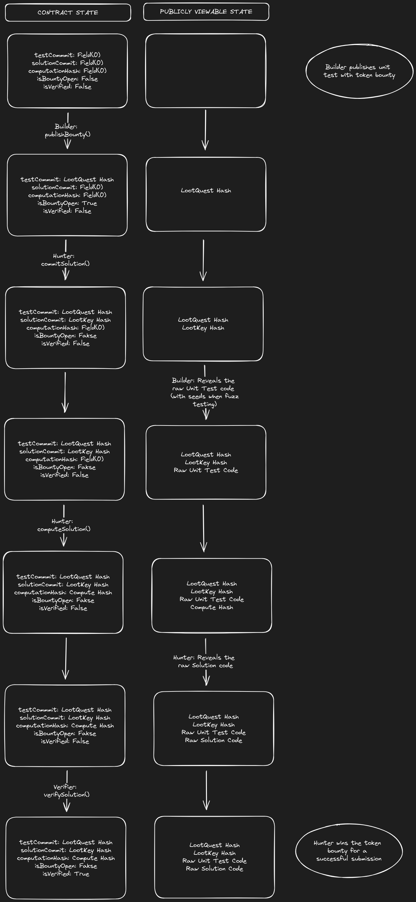

# Mina zkApp: zkBUIDL Bounties
zkBUIDL Bounties is a platform for visionaries to fund and build smart contracts via a test-driven approach in a decentralized and gamified way. The protocol aims to leverage recursive zkProofs using o1js to facilitate the building, testing, and funding of smart contract development in a trustless and permissionless way. The platform consists of two main parties: Bounty Builders and Bounty Hunters. Bounty Builders (BBs) write unit-tests and fund them with token bounties, creating "Loot Quest" zkProofs. Bounty Hunters (BHs), on the other hand, write code solutions to solve these unit-tests, thereby creating "Loot Key" zkProofs that can be verified and used to unlock the bounty. By using recursive zkProofs, Bounty Hunters can earn bounties for their work in a permissionless way while Bounty Builders can be certain the code solutions they receive are up to their testing standards. By following the principles of test-driven-development, zkBUIDL Bounties creates an environment of total decentralization between the funders and builders of a project.

## v1.0.0:

A very naive implementation of the basic interactions between the BB and the BH with a trusted third party setup that relies on a Verifier to verify that the solution computes and passes the given unit test. 

Assumptions:
- BB is honest and supplies a valid and solvable test
- BV is honest and correctly runs the test and solution
- BH only needs to supply one Bool (true/false) when claiming a valid solution (i.e the smart contract does not check if the computation ran correctly, it only checks the result imputted by the BH)

Quirks:
- Only one bounty can be created and claimed
- Only one BB and BH interact with the smart contract at a time
- Smart contract stores all the info onchain (so the info is limited)


Added Functionality:
- Commit single hash of unit test onchain
- Commit single hash of code solution onchain
- Commit single computation of solution against unit test onchain 
- Verify hash of unit test and solution onchain matches the publicly revealed unit test and selected solution and computation matches previous commitment

Pending Features:
- Token bounty logic
- Unique permissions for builder, hunter, verifier.
- Multiple bounty submissions (merkle tree for different BBs connected to their unique bounties?)
- Multiple solution submissions (merkle tree for each bounty to connect potential solutions)
- Recursive proofs implementation
- And a lot more...

## Contract Flow Diagram


## How to run tests

The current tests model the interactions between Bounty Builders and Hunters using onchain methods.

```sh
npm run test
npm run testw # watch mode
```


## License

[Apache-2.0](LICENSE)